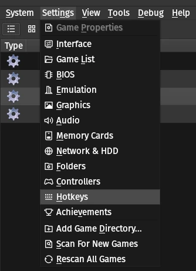

# Extensions

## List

A collection of extensions to enhance development with AthenaEnv.

| Name | Author 
| --- | --- |
[Types](https://github.com/Wellinator/athenaenv-starter-js/tree/main/%40types/athena-env) | Wellinator
[Utilities](https://github.com/j0sedavi/Modules-athena-Env) | j0sedavi
[FontOutline](https://github.com/PauloDevv/Outline-in-Text-for-AthenaENV-PS2) | NGN MODS  
[Mercury SM](https://github.com/GustavoFurtad2/MercurySM-AthenaPS2) | GustavoFurtad2      
[Hot Reload](https://github.com/DanielAbrante/athena-env-website/tree/main/extensions/hot_reload.mjs) | Daniel Abrante      
  
## Hot Reload (Linux)

- Supports: **x11** and **XWayland**
- Compatible with: **Flatpak** or **AppImage** formats

### Prerequisites

Before you begin, make sure you have the following installed:

1. [Node.js](https://nodejs.org/en/download/) _(version 22 or greater)_.
2. [xdotool](https://github.com/jordansissel/xdotool)

### How to use

1. Download the [extension](https://github.com/DanielAbrante/athena-env-website/tree/main/extensions/hot_reload.mjs)

2. Access your pcsx2 settings to modify the key combination for resetting the virtual machine.




3. Open the **hot_reload.mjs** file and set the ```RESET_VIRTUAL_MACHINE_KEY``` variable to match your desired key combination.

Example:

```js
const RESET_VIRTUAL_MACHINE_KEY = "ctrl+r";
```

If you are using the **AppImage** version of PCSX2, set the ```pcsx2AppimageCommand``` variable to the full path of your AppImage file.

Example:

```js
const pcsx2AppimageCommand = "/home/user/Applications/pcsx2.AppImage";
```

4. Run the project

```sh
node hot_reload.mjs
```